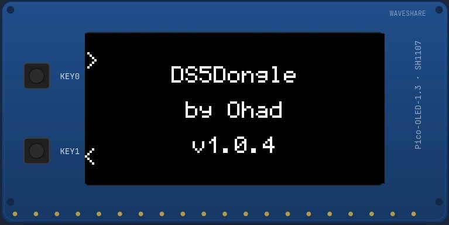

# DS5Dongle by Ohad v1.0.5

**DS5Dongle by Ohad** is custom firmware for the Raspberry Pi Pico 2 W with the Waveshare Pico-OLED-1.3 display. It bridges a DualSense controller over Bluetooth to a computer over USB, with an onboard OLED interface for status, settings, audio, remapping, diagnostics, and pairing slots.



## Language

- [English](README.md)
- [עברית](README_HE.md)

## Important files

- `DS5Dongle-by-Ohad-1.0.5.uf2` - generated by GitHub Actions after a build.
- `USER_MANUAL_EN.pdf` - English user manual.
- `USER_MANUAL.pdf` - Hebrew user manual.
- `PRODUCT_SPECIFICATION_EN.pdf` - English product specification.
- `PRODUCT_SPECIFICATION.pdf` - Hebrew product specification.
- `CHANGELOG.md` - English changelog.
- `CHANGELOG_HE.md` - Hebrew changelog.


## Latest 1.0.5 audio route fix

This package includes the Audio Route Fix for browser/tester audio recovery. If a page such as DualSense Tester opens the audio stream and then closes or stops sending packets, the firmware recovers the controller audio route automatically without requiring a headset plug/unplug event.

## Main features

- DualSense Bluetooth bridge.
- Native USB HID output to the computer.
- USB Audio at 48 kHz.
- Bluetooth microphone path from the controller.
- AudioKeep: prevents Idle shutdown while audio is active.
- 128x64 OLED UI with Status, Slots, Lightbar, Trigger Test, Gyro, Touchpad, Diagnostics, BT Signal, VU, Settings, and Remap screens.
- Button remapping for 19 inputs, including special `Off` and `PicoMic` targets.
- PowerCombo: `PS + Options` for safe controller disconnect/poweroff.
- Multi-slot pairing with up to 4 slots.
- UF2 firmware update flow.

## GitHub build

The firmware version is controlled from:

```yaml
.github/workflows/build.yml
FIRMWARE_VERSION: 1.0.5
```

The build artifact is named:

```text
DS5Dongle-by-Ohad-1.0.5.uf2
```

## Quick start

1. Download the UF2 file from the GitHub Actions artifact.
2. Put the Pico into BOOTSEL mode.
3. Drag the UF2 file onto the `RPI-RP2` drive.
4. Pair or connect the DualSense controller over Bluetooth.
5. Use `KEY0` / `KEY1` on the OLED board to navigate the interface.

## OLED navigation

- `KEY0`: next screen.
- `KEY1`: previous screen.
- Long `KEY1`: change OLED brightness.
- `KEY0 + KEY1`: reboot the Pico.
- Controller shortcut: `Options + D-Pad Left/Right` switches OLED screens.

## Documentation

- `docs/en/USER_MANUAL.md`
- `docs/en/PRODUCT_SPECIFICATION.md`
- `docs/en/FAQ.md`
- `docs/en/TROUBLESHOOTING.md`
- `docs/he/USER_MANUAL.md`
- `docs/he/PRODUCT_SPECIFICATION.md`
- `docs/he/FAQ.md`
- `docs/he/TROUBLESHOOTING.md`

For normal use, read `USER_MANUAL_EN.pdf`. For hardware and firmware details, read `PRODUCT_SPECIFICATION_EN.pdf`.


## Version 1.0.5

Adds an optional Hebrew OLED user interface. The default language remains English. Change it from `Settings -> Language` and save with Triangle.


### OLED polish note
The 1.0.5 OLED UI uses button symbols in the Remap screen where possible, in both English and Hebrew UI modes.
